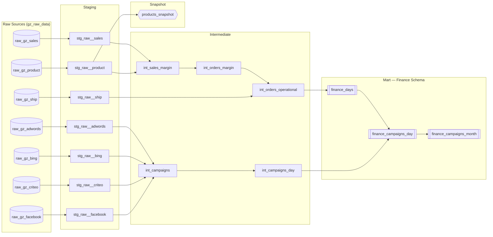

# Sales KPI Analysis with DBT

> A complete DBT data pipeline built on **BigQuery**, transforming raw e-commerce data into actionable sales and advertising KPIs — from raw sources to finance-ready mart tables.

---

## Overview

This project is part of a **Data Analyst training portfolio**. It models the data of a fictional organic e-commerce company (**Greenweez**) using [dbt](https://www.getdbt.com/), following the standard **Staging → Intermediate → Mart** architecture.

The pipeline consolidates:
- **Sales & order data** (revenue, margin, operational costs)
- **Advertising campaigns** from 4 platforms (Google Ads, Bing, Criteo, Facebook)

...into daily and monthly finance tables ready for BI reporting.

---

## Data Pipeline (DAG)



---

## Project Structure

```
.
├── models/
│   ├── staging/
│   │   └── raw/                   # One model per raw source table
│   │       ├── stg_raw__sales.sql
│   │       ├── stg_raw__product.sql
│   │       ├── stg_raw__ship.sql
│   │       ├── stg_raw__adwords.sql
│   │       ├── stg_raw__bing.sql
│   │       ├── stg_raw__criteo.sql
│   │       └── stg_raw__facebook.sql
│   ├── intermediate/              # Business logic & joins
│   │   ├── int_sales_margin.sql
│   │   ├── int_orders_margin.sql
│   │   ├── int_orders_operational.sql
│   │   ├── int_campaigns.sql
│   │   └── int_campaigns_day.sql
│   ├── mart/
│   │   └── finance/               # Materialized tables — Finance schema
│   │       ├── finance_days.sql
│   │       ├── finance_campaigns_day.sql
│   │       └── finance_campaigns_month.sql
│   └── schema.yml                 # Sources, model & column documentation + tests
├── macros/
│   └── functions.sql              # margin_percent() reusable macro
├── snapshots/
│   └── products_price.sql         # SCD Type 2 on product purchase prices
├── packages.yml                   # dbt_utils dependency
└── dbt_project.yml
```

---

## Key Metrics Explained

| Metric | Formula |
|---|---|
| `margin` | `revenue − purchase_cost` |
| `margin_percent` | `(revenue − purchase_cost) / revenue` |
| `operational_margin` | `margin + shipping_fee − (log_cost + ship_cost)` |
| `ads_margin` | `operational_margin − ads_cost` |
| `average_basket` | `AVG(revenue)` per order per day |

> The `margin_percent` calculation uses a custom `{{ margin_percent() }}` macro (in `macros/functions.sql`) that wraps `SAFE_DIVIDE` to handle zero-revenue edge cases safely.

---

## Snapshot

`snapshots/products_price.sql` implements a **SCD Type 2** on the product catalog using dbt's `check` strategy. Every time a product's attributes (e.g. `purchase_price`) change, a new historical record is created — enabling accurate margin recalculation for past periods.

---

## Testing & Data Quality

All models and sources are documented in `models/schema.yml` with:
- `not_null` constraints on all primary and critical columns
- `unique` constraints on primary keys (including composite keys like `orders_id || '_' || pdt_id`)
- `freshness` check on the `sales` source (warns after 90 days without new data)

Run all tests with:

```bash
dbt test
```

---

## Getting Started

### Prerequisites

- Python 3.8+
- A BigQuery project with the `gz_raw_data` schema populated
- A configured `~/.dbt/profiles.yml` with a `default` profile pointing to your BigQuery project

### Installation

```bash
# Install dbt-bigquery
pip install dbt-bigquery

# Install dbt packages (dbt_utils)
dbt deps

# Check your connection
dbt debug
```

### Running the pipeline

```bash
# Run all models
dbt run

# Run tests
dbt test

# Run + test in one command
dbt build

# Run snapshots
dbt snapshot
```

---

## Tech Stack

| Tool | Role |
|---|---|
| [dbt](https://www.getdbt.com/) | Data transformation framework |
| [BigQuery](https://cloud.google.com/bigquery) | Cloud data warehouse |
| [dbt_utils](https://hub.getdbt.com/dbt-labs/dbt_utils/) | `union_relations` macro for campaign consolidation |

---

*First dbt project — built as part of a Data Analyst training curriculum.*
